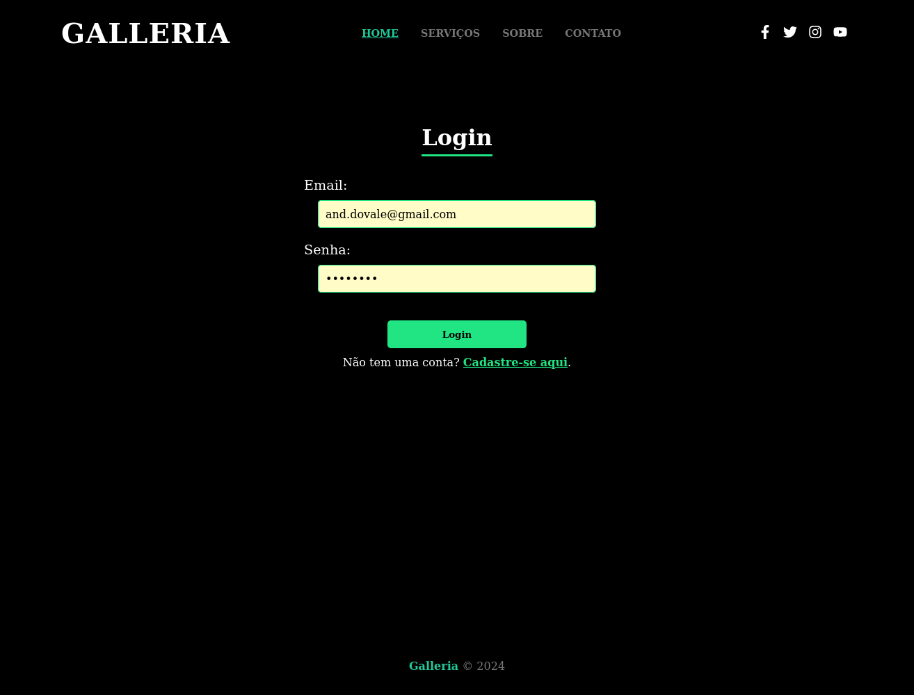

I'm<h1 align="center">Galleria: Plataforma de Fotos</h1>

## Sumário

* [Descrição](#descrição)
* [Requisitos](#requisitos)
* [Ferramentas](#ferramentas)
* [Dificuldades](#dificuldades)
* [Resultados](#resultados)
* [Conclusão](#conclusao)

## Descrição

**Galleria** é uma plataforma de fotos em desenvolvimento, construída com **React**, **JavaScript**, e **Node.js** para criar uma interface interativa e eficiente. Utiliza **CSS3** para design e **Firebase** para autenticação e armazenamento em tempo real. O projeto visa oferecer uma experiência intuitiva e segura para armazenamento e compartilhamento de fotos.

## Requisitos

- [x] Pagina Principal com as categorias das fotos do site
- [x] Pagina sobre o fotografo
- [x] Pagina de contato por mensagem de email
- [x] Pagina de serviços oferecidos pelo fotografo
- [x] Sistema de cadastro e login com a autenticação do Auth do firebase
- [x] Json para puxar os dados sobre as fotos
- [x] Pagina de cada tipo de foto selecionada.
- [x] Uso de notificaçoes de açoes no site.

## Ferramentas

- **React**: Biblioteca JavaScript para criar interfaces dinâmicas e reutilizáveis, facilitando o desenvolvimento de aplicações interativas.
- **JavaScript**: Linguagem de programação usada para implementar a lógica da aplicação e interatividade entre os componentes.
- **Node.js**: Ambiente de execução JavaScript no servidor, responsável pela gestão do backend e comunicação com o banco de dados.
- **CSS3**: Folha de estilo usada para criar layouts modernos e responsivos, garantindo uma boa experiência visual em diferentes dispositivos.
- **Firebase**: Plataforma do Google que fornece autenticação e armazenamento em tempo real, facilitando o gerenciamento de usuários e fotos.

## Dificuldades

Durante o desenvolvimento do Galleria, enfrentamos diversos desafios que contribuíram para o aprendizado e aperfeiçoamento das soluções implementadas:

1. Integração com o Firebase:
Configurar a autenticação e o armazenamento em tempo real foi um dos principais desafios. Foi necessário estudar a documentação oficial e realizar testes para garantir que o sistema de login e cadastro estivesse seguro e funcional.

2. Design Responsivo:
Garantir que a interface fosse visualmente atrativa e funcional em diferentes dispositivos exigiu ajustes no layout e adaptações no CSS3. Testar em diversos tamanhos de tela e corrigir inconsistências consumiu tempo, mas trouxe um resultado satisfatório.

3. Gerenciamento de Dados Dinâmicos:
Trabalhar com um JSON para carregar as informações das fotos apresentou dificuldades na organização e manipulação dos dados, especialmente para garantir uma navegação fluida entre as páginas de categorias e fotos.

4. Notificações de Ações no Site:
Implementar feedbacks visuais para as ações realizadas pelo usuário, como login, envio de mensagens ou seleção de categorias, foi desafiador devido à necessidade de sincronizar as respostas do backend com o front-end em tempo real.

## Resultados

Pagina de login

Pagina principal

Pagina de serviços

Pagina sobre o fotografo

Pagina de Contato com o fotografo

Pagina das fotos do tipo de categoria, no caso esportes

## Conclusão

O projeto Galleria foi uma oportunidade enriquecedora para aplicar e aprimorar habilidades em tecnologias modernas, como React, JavaScript, Node.js, CSS3, e Firebase. O resultado final é uma plataforma funcional e atraente, que atende aos requisitos propostos, como páginas dinâmicas, sistema de autenticação robusto e armazenamento de fotos seguro.

Embora desafios tenham surgido ao longo do desenvolvimento, como a integração do Firebase e o design responsivo, essas dificuldades foram superadas com pesquisa, aprendizado contínuo e trabalho em equipe. O projeto demonstra a importância de combinar tecnologias front-end e back-end para criar uma aplicação completa e eficiente.
